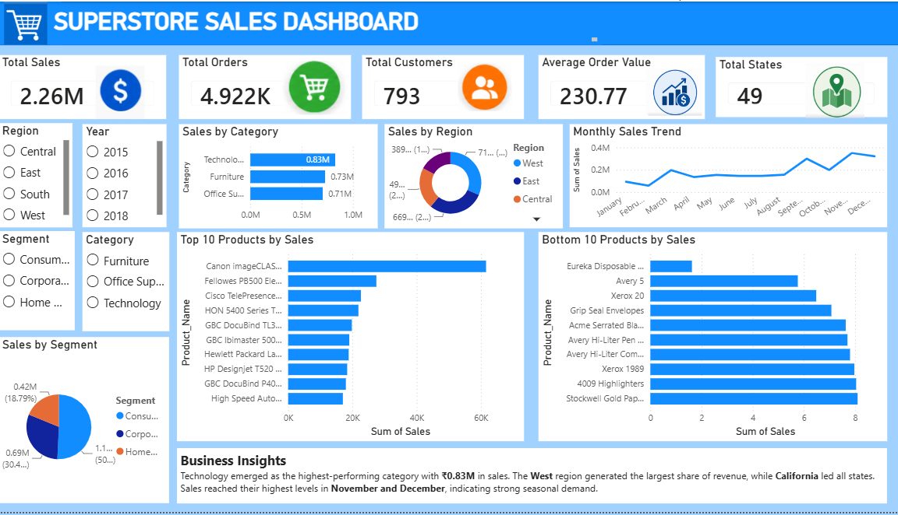

# 📊 Superstore Sales Analysis

## 📌 Project Overview

This project analyzes the Superstore Sales dataset to evaluate sales performance across different regions, categories, customer segments, and time periods. The objective is to identify sales trends, top and bottom performing products, and provide actionable business recommendations using data visualization.

---

## 🎯 Objectives

- Clean and prepare the sales dataset.
- Analyze sales performance across regions, categories, and time.
- Identify top and bottom performing products.
- Analyze monthly sales trends and seasonality.
- Create key business KPIs.
- Build an interactive Power BI dashboard.
- Provide business recommendations based on the analysis.

---

## 📂 Dataset

- **Dataset:** Superstore Sales
- **Source:** Kaggle
- **Link:** https://www.kaggle.com/datasets/bhanupratapbiswas/superstore-sales

---

## 🛠️ Technologies Used

- Python
- Pandas
- Matplotlib
- Google Colab
- Power BI
- GitHub

---

## 🧹 Data Preparation

The following preprocessing steps were performed:

- Removed duplicate records
- Checked for missing values
- Converted `Order_Date` and `Ship_Date` into datetime format
- Created new features:
  - Year
  - Month
  - Month Name
  - Quarter
  - Weekday
  - Shipping Days

---

## 📈 Key Performance Indicators (KPIs)

- Total Sales
- Total Orders
- Total Customers
- Average Order Value
- Total States Covered

> **Note:** Profit Margin was not calculated because the dataset does not contain Profit or Cost information.

---

## 📊 Dashboard Features

The Power BI dashboard includes:

- KPI Cards
  - Total Sales
  - Total Orders
  - Total Customers
  - Average Order Value
  - Total States

- Interactive Filters
  - Region
  - Year
  - Category
  - Segment

- Visualizations
  - Monthly Sales Trend
  - Sales by Category
  - Sales by Region
  - Sales by Segment
  - Top 10 Products by Sales
  - Bottom 10 Products by Sales

- Business Insights

---

## 🔍 Key Insights

- Technology generated the highest sales among all product categories.
- The West region recorded the highest overall sales.
- The Consumer segment contributed the largest share of revenue.
- Sales reached their highest levels during November and December, indicating seasonal demand.
- A few products consistently generated very low sales and may require promotional strategies or inventory review.

---

## 💡 Business Recommendations

1. Promote high-performing products through targeted marketing campaigns.
2. Improve sales of low-performing products using discounts, bundles, or revised pricing strategies.
3. Increase marketing efforts in lower-performing regions.
4. Plan inventory and promotional campaigns around peak sales months.
5. Improve shipping efficiency to enhance customer satisfaction.

---

## 📁 Project Structure

```
Superstore-Sales-Analysis/
│
├── Superstore_Sales_Analysis.ipynb
├── Superstore_Dashboard.pbix
├── README.md
└── dashboard.png
```

---

## 📷 Dashboard Preview

Add your dashboard screenshot to the repository as `dashboard.png`.

```markdown

```

---

## 🚀 How to Run

1. Clone this repository.

```bash
git clone https://github.com/your-username/Superstore-Sales-Analysis.git
```

2. Open `Superstore_Sales_Analysis.ipynb` in Google Colab or Jupyter Notebook.

3. Install the required libraries if needed.

```bash
pip install pandas matplotlib
```

4. Run all notebook cells.

5. Open `Superstore_Dashboard.pbix` in Power BI Desktop to explore the interactive dashboard.

---

## 👩‍💻 Author

**Pelluru Pavani**

B.Tech – Computer Science & Engineering

---

⭐ If you found this project useful, consider giving this repository a star!
